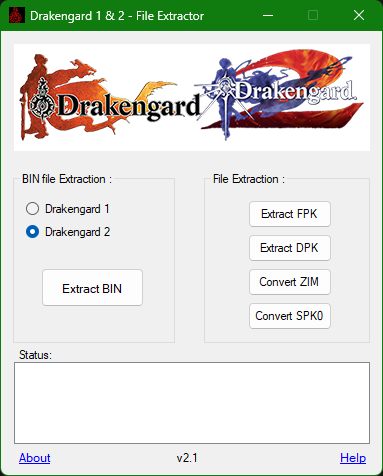
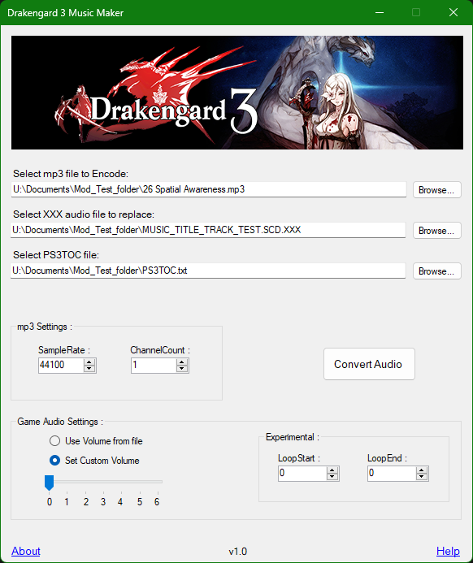

# Game modding related tools
## [Drakengard 1 & 2 File extractor](https://github.com/Surihix/Drakengard1and2Extractor)
This is a winforms app, that has multiple options to extract data from specific file formats from the PS2 games, Drakengard 1 and 2.

  
## [Drakengard 3 Music Maker](https://github.com/Surihix/Drakengard3MusicMaker)
This is a winforms app that allows users to replace any of the music file from the PS3 game Drakengard 3, with a custom music file of their choice. 

  
## [Drakengard 3 xxx To mp3 extractor app](https://github.com/Surihix/Drakengard3xxxToMp3)
This app helps in extracting the audio files from Drakengard 3 to a playable mp3 format. this was earlier designed to be a part of the music maker app but was eventually made as a separate console app to allow batch conversion of multiple audio files.
  
## [Lightning Returns Music Volume Slider](https://github.com/Surihix/LRMusicVolumeSlider)
This winforms app helps in adjusting the volume levels of the music files from the game Lightning Returns Final Fantasy XIII PC version. as the game doesn't have the option to increase the volume levels ingame, I took it upon myself to make a app that allows users to increase and decrease the volume of the music to whatever level they want. 

  
## [WhiteBinTools](https://github.com/Surihix/WhiteBinTools)
This app helps in extracting data from the Final Fantasy XIII trilogy's game resource archive files as well as repack the extracted data back into the archive. this app started development as a practise for me to better understand the file formats of the archives which eventually ended up with me making a full suite of unpacking and repacking tools to meet specific requirements for future mod ideas and for others to use in the modding community. 

  
# File operation related tools:
## [Hash Check](https://github.com/Surihix/HashCheck)
A simple SHA-256 hash checking app that allows users to quickly check the hash of two files and see if they matches for both the files. can be useful when dealing with a lot of similarly named files that may or may not have the same binary data.
  
## [Devi Pack Unpack tool](https://github.com/Surihix/DeviPackUnpackTool)
A app that I made for making my own archive like format for storing one or more files. can be useful for those looking into storing their data in a non standard form and the app is available for both .net core and .net framework. 
  
## [Zlib Decompressor](https://github.com/Surihix/ZLIB_decompressor)
A app that helps in decompressing zlib compressed data with the help of SharpZipLib C# library. can be useful for game modders who want a quick and fast zlib decompressing app to decompress zlib data.
  
## [HeaderBytes Remover](https://github.com/Surihix/HeaderBytesRemover)
One of my first apps that helps in trimming a user specified amount of bytes from the starting position of any file. 
